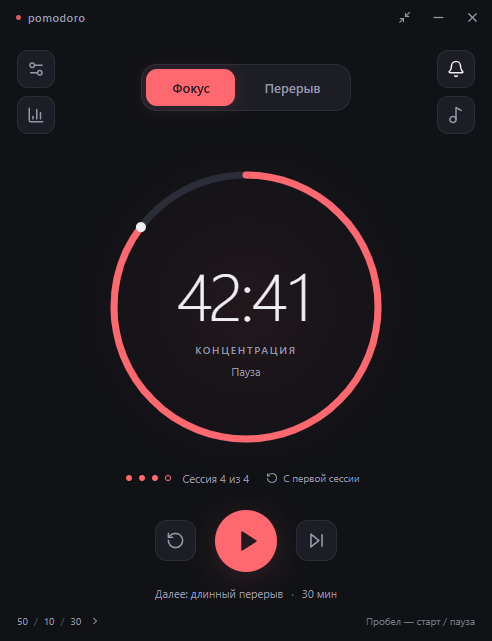

# Pomodoro

Минималистичный таймер для Windows и macOS на **Electron + React + TypeScript**.



## Что работает в версии 0.2.3

- Круговой таймер: работа, короткий и длинный перерывы.
- Пресеты **25 / 5 / 15** и **50 / 10 / 30**; свои длительности от 1 до 180 минут.
- Длинный перерыв после четырёх завершённых рабочих сессий по умолчанию; можно выбрать от 2 до 8.
- Старт, пауза, продолжение, сброс, пропуск и ручной выбор этапа.
- Русский и английский. При первом запуске определяется язык системы, затем сохраняется выбор пользователя.
- Темы Midnight, Paper & Coral, Sage; отдельные цвета этапов.
- Мини-окно, закрепление поверх других окон, трей / строка меню macOS.
- Системные уведомления, сигнал окончания, белый и коричневый шум с регулировкой громкости.
- Статистика за сегодня и семь дней, локальное сохранение истории и настроек.
- Раздельный автозапуск перерывов и рабочих сессий.
- «С первой сессии» рядом со счётчиком: возвращает к сессии 1 и полному времени фокуса после подтверждения. Статистика и настройки сохраняются.
- При открытии в новый местный день приложение предлагает начать с первой сессии или продолжить оставшийся цикл. Отказ запоминается на день, в том числе после перезапуска. Работающий таймер не прерывается.

Архитектура, правила зависимостей и идеи следующих улучшений описаны в [docs/architecture.md](docs/architecture.md).

Версия приложения отображается внизу настроек и автоматически берётся из сборки. Выпуск релизов и настройка автообновлений описаны в [docs/updates.md](docs/updates.md).

## Запуск

Нужны Node.js **22.12+** и npm. Все команды выполняются из папки этого проекта.

```sh
npm ci
npm run build
npm start
```

Electron может скачать свою платформенную сборку при первом запуске. Для последующей работы интернет не нужен.

Разработка с обновлением React без перезапуска:

```sh
npm run dev
```

После изменения основного процесса Electron или preload перезапусти `npm run dev`.

Предпросмотр интерфейса в браузере:

```sh
npm run dev:web
```

Браузерный режим предназначен для разработки интерфейса: он хранит отдельное состояние в localStorage и не предоставляет системный трей, закрепление окна и уведомления Electron.

## Управление и поведение

- **Пробел** — старт / пауза, когда фокус не находится на кнопке или в поле ввода.
- **R** — сброс текущего этапа. **Escape** — закрыть панель.
- Сброс и пропуск не добавляют завершённую рабочую сессию в статистику.
- После длинного перерыва начинается новый цикл. Ручной переход из длинного перерыва к фокусу также начинает новый цикл.
- Изменение длительностей сохраняется сразу и применяется к следующему этапу. Текущий запущенный или приостановленный таймер сохраняет свою длительность; сброс применит новые значения.
- Изменение количества сессий до длинного перерыва сбрасывает текущий цикл, сохраняя историю.
- По умолчанию следующий этап ожидает нажатия старта.
- При сне компьютера активный таймер ставится на паузу. После пробуждения его можно продолжить вручную.
- После полного выхода или перезапуска незаконченный таймер восстанавливается на паузе. Время при закрытом приложении не засчитывается как работа.
- Крестик по умолчанию скрывает окно в трей. Для полного выхода используй «Выйти» в меню трея либо отключи сворачивание при закрытии.
- Фоновые звуки играют только во время запущенной рабочей сессии.

## Данные

При запуске из исходников и из готовой сборки используется один файл `state.json` в постоянной папке данных:

- Windows: `%APPDATA%/Pomodoro/`.
- macOS: `~/Library/Application Support/Pomodoro/`.

Перенос папки проекта и переключение между `npm run dev`, `npm start` и готовой сборкой не меняют профиль. Если общего профиля ещё нет, старый файл `../../work/app-data/state.json` импортируется автоматически; оригинал остаётся на месте. Существующий общий профиль имеет приоритет. Для изолированных запусков можно передать переменную окружения `POMODORO_DATA_DIR`; в этом случае импорт отключён.

Приложение допускает только один экземпляр на профиль. Если старая сборка уже работает в трее, новый запуск откроет её окно. Перед запуском изменённого кода сначала полностью выйди из старой версии через меню трея.

Настройки и история записываются через временный файл и переименование. Активное состояние сохраняется каждые пять секунд и после действий пользователя. После аварийного завершения возможна потеря последних пяти секунд отсчёта. История ограничена последними 10 000 рабочими сессиями.

Сетевых аккаунтов, аналитики и синхронизации нет. Если JSON повреждён, он сохраняется рядом с суффиксом `.unreadable-*`, а приложение запускается с настройками по умолчанию.

## Сборка и проверки

```sh
npm test            # Проверки логики таймера
npm run check       # Biome: форматирование, линтинг, импорты
npm run format      # Форматирование файлов
npm run check:fix   # Безопасные исправления Biome
npm run verify      # Biome + TypeScript + тесты
npm run typecheck   # Проверка TypeScript
npm run build
npm run test:ui     # Настоящий Electron, отдельные тестовые данные
npm run test:new-day # Новый день, ручной сброс, RU/EN и сохранение выбора после перезапуска
npm run test:persistence # Все настройки, перезапуск, перенос папки и импорт старого профиля
npm run dist:win    # Windows NSIS installer (x64)
npm run dist:mac    # macOS DMG и ZIP (Apple Silicon и Intel), запускать на macOS
```

Готовые сборки появляются в `release/`. Для Windows установлена сборка без цифровой подписи. Для публичного распространения macOS потребуется отдельно настроить Apple Developer signing / notarization. macOS нельзя считать проверенной только на основании успешной Windows-сборки.

В `.github/workflows/build.yml` подготовлена сборка Windows и macOS. Чтобы использовать её, размести содержимое этой папки в корне репозитория и запусти workflow вручную либо создай тег `v*`. Workflow ничего не публикует, а сохраняет сборки как artifacts.

## Структура

- `src/core/` — независимая логика таймера и проверка настроек.
- `src/application/` — сервис команд, сохранения и событий; одинаковый для Electron и браузера.
- `electron/` — отдельные адаптеры хранения, окон, уведомлений, трея и IPC.
- `src/app/`, `src/features/` — React-компоновка и интерфейс отдельных функций.
- `src/shared/` — контракты, RU/EN и общие UI-компоненты.
- `src/styles/` — темы и стили частей интерфейса.
- `src/services/` — адаптер браузерного предпросмотра и синтез звука.
- `tests/`, `scripts/smoke.mjs` — логические и интеграционные проверки.

В `biome.json` закреплены рекомендованные правила линтера и единый формат кода. В CI добавлена проверка качества; локально для полного набора проверок используй `npm run verify`.

Renderer изолирован: Node integration отключён, sandbox и context isolation включены. В production используются локальный протокол, строгая Content Security Policy, проверка отправителя IPC и запрет новых окон / навигации.

---

**English:** A local-first Pomodoro timer for Windows and macOS. Use `npm ci`, `npm run build`, and `npm start`. The app includes Russian and English UI, two presets, custom timings, long-break cycles, three themes, mini mode, tray controls, notifications, ambient noise, and local statistics. Build Windows installers with `npm run dist:win`; build macOS packages on a Mac with `npm run dist:mac`.
