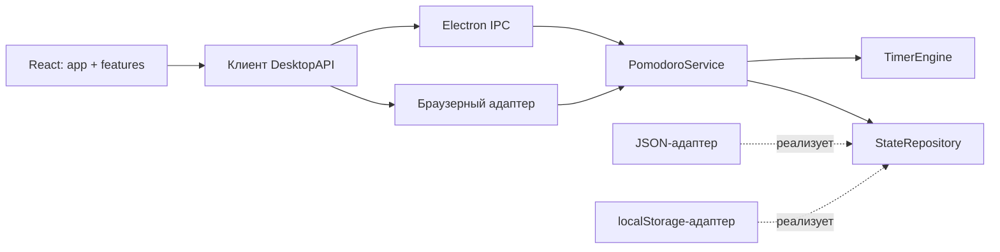

# Архитектура Pomodoro

Приложение разделено по ответственности. Логика таймера не зависит от React, Electron, файловой системы и способов отображения. Electron и браузерный предпросмотр используют один сервис команд; рисование интерфейса не управляет ходом времени.

```text
src/core/                   Правила Pomodoro, типы, валидация
src/application/            Команды, события, сохранение через интерфейс
electron/                   Адаптеры Windows/macOS и точка сборки приложения
src/services/               Клиент Electron / браузера и Web Audio
src/shared/                 Контракт IPC, RU/EN, общие UI-компоненты
src/features/               Интерфейс таймера, настроек, статистики и звука
src/app/                    Компоновка окна и подключение React к клиенту
src/styles/                 Токены темы и стили отдельных частей интерфейса
```

## Направление зависимостей



- `core` импортирует только собственные модули.
- `application` импортирует только `core` и собственные модули. Часы передаются как функция, хранилище — как интерфейс `StateRepository`.
- `electron/main.ts` соединяет адаптеры и подписки. Работа с файлами вынесена в `state-store.ts`, окнами — в `window.ts`, треем — в `tray.ts`, уведомлениями — в `notifications.ts`. Проверка IPC и политика безопасности находятся отдельно.
- `preload.ts` предоставляет ограниченный API. Его импорты контрактов — только типы: sandboxed preload не требует произвольные локальные модули во время выполнения.
- `usePomodoro` подключает React к API, обрабатывает подписки, горячие клавиши и звук. Компоненты получают состояние и callbacks, не читают диск и не меняют таймер напрямую.
- `TimerEngine` проверяет переходы и засчитывает сессии. Сервис записывает состояние после команды и публикует события. Периодический checkpoint нужен активному таймеру и повторной попытке после ошибки записи, а не бездействующему приложению.

Автоматический тест `tests/architecture.test.ts` не позволяет импортировать UI или платформенные зависимости в `core` и `application`.

## Сброс текущего цикла

Команда `reset-cycle` отличается от `reset`:

| Команда | Счётчик цикла | Текущий этап | История |
|---|---|---|---|
| `reset` | Сохраняется | Начало того же этапа | Сохраняется |
| `reset-cycle` | Обнуляется | Начало фокуса, на старте | Сохраняется |

Кнопка «С первой сессии» расположена рядом с индикатором сессий. Подтверждение объясняет, что незавершённый этап остановится. Отмена и Escape ничего не меняют. Если рабочая сессия уже действительно закончилась к моменту команды, она остаётся в истории. Сброс сохраняется сразу и переживает перезапуск; в интерфейсе отображается «Сессия 1 из N».

## Предложение нового цикла в новый день

`PomodoroService` хранит в `cycleDay` местную календарную дату последнего действия с циклом. При запуске, возвращении фокуса или показе окна React отправляет `check-new-day`. Если дата стала позже и остался прогресс, сервис выставляет `newDayAvailable` в snapshot. Проверка не меняет таймер и не засчитывает сессии.

Диалог предлагает «С первой сессии» (`reset-cycle`) или «Продолжить цикл» (`keep-cycle`). Во втором случае таймер остаётся как есть, дата обновляется и сохраняется: повторное открытие в тот же день не задаёт вопрос снова. Escape и закрытие дневного предложения также сохраняют выбор продолжить. Следующее предложение возможно на следующий день. Мини-окно откладывает показ до разворачивания.

Запущенный таймер не прерывается и не получает диалог из-за смены даты. Проверка не выполняется каждую секунду и не сбрасывает состояние в полночь. Пустой цикл на первой сессии не требует предложения. В старых профилях дата определяется по последней записи истории, а при отсутствии таких данных начинается с сегодняшней даты. Статистика и настройки не очищаются.

## Сохранение и совместимость

Формат `state.json` остаётся `schema: 1`; существующие настройки и история читаются без сброса. И исходники, и готовая сборка используют AppData / Application Support. Пользовательский `POMODORO_DATA_DIR` сохраняет изоляцию тестов. Старый профиль разработки импортируется только при отсутствии общего профиля и не удаляется.

## Biome и проверки

Biome закреплён точной версией в package.json/lockfile. Включены рекомендованные правила, проверка доступности, форматирование TS/TSX/JS/CSS/JSON и организация импортов. Сгенерированные файлы, зависимости и сборки исключены.

```sh
npm run format      # Форматирование
npm run lint        # Линтинг, предупреждения считаются ошибками
npm run check       # Линтинг + форматирование + импорты
npm run check:fix   # Безопасные автоматические исправления
npm run verify      # Biome + TypeScript + тесты логики и границ
npm run build
npm run test:ui
npm run test:persistence
npm run test:new-day
```

CI проверяет Biome, TypeScript, тесты и сохранение. Отдельный workflow собирает Windows/macOS. В VS Code можно использовать расширение Biome и готовые настройки format-on-save; для JetBrains доступен плагин Biome. Конфигурация основана на [официальной документации Biome](https://biomejs.dev/guides/getting-started/).

## Что развивать дальше

1. **Названия задач и метки сессий.** По желанию одна строка под таймером; затем статистика по занятиям.
2. **Дневная цель.** Например, четыре сессии; спокойный индикатор без обязательных серий и штрафов.
3. **Экспорт/импорт резервной копии.** Перенос между компьютерами без аккаунта; проверка формата до импорта.
4. **Глобальные горячие клавиши.** Настраиваемые старт/пауза и мини-режим с обработкой конфликтов.
5. **Положение и размер окна.** Восстановление с учётом отключённого монитора.

Аккаунты и облачную синхронизацию разумно добавлять после устойчивого локального сценария и проверки macOS.
